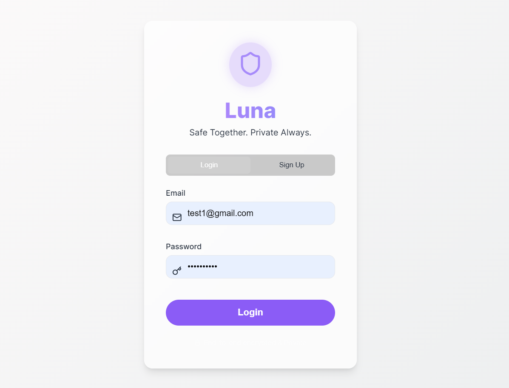
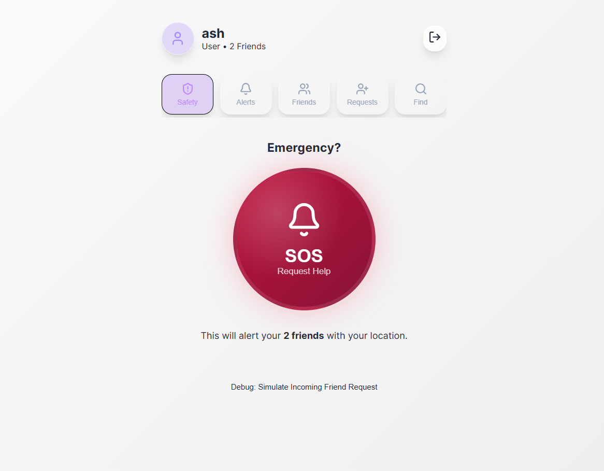
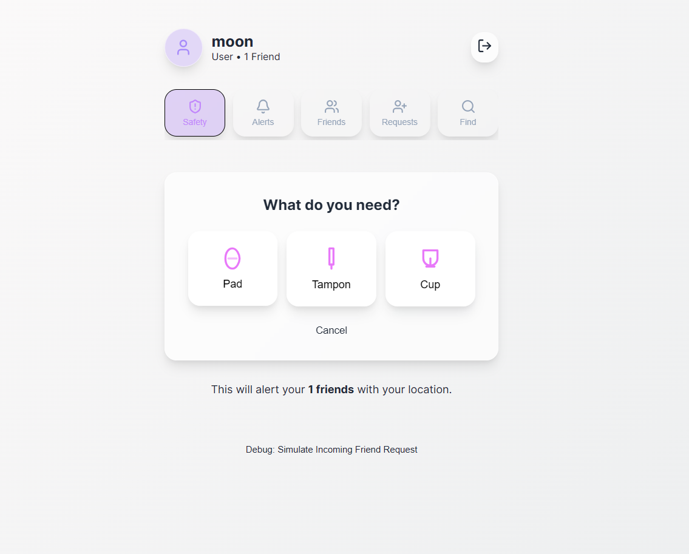
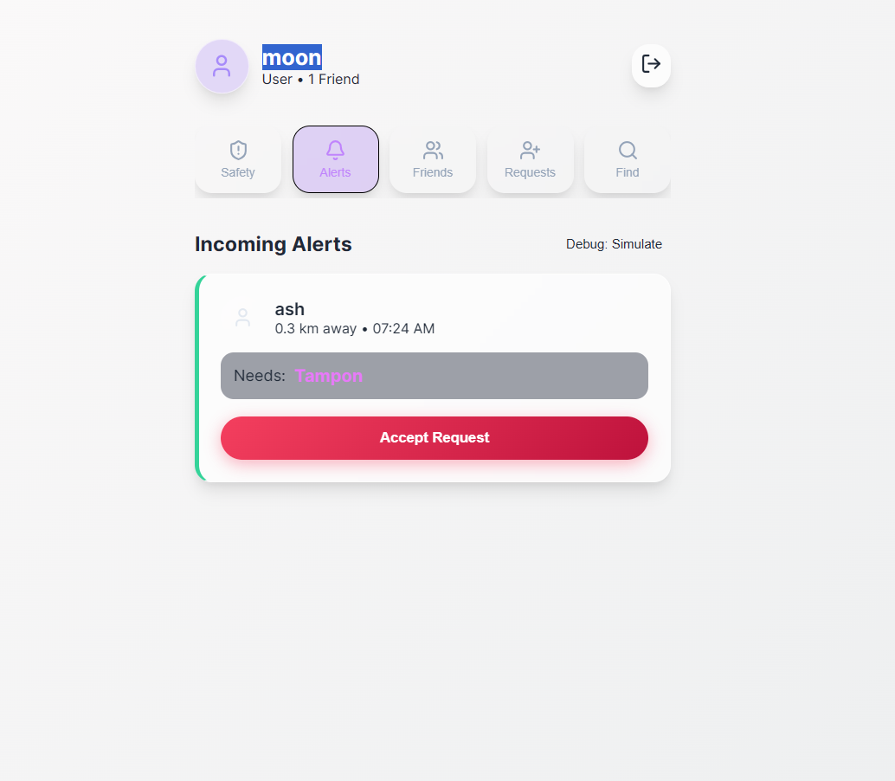
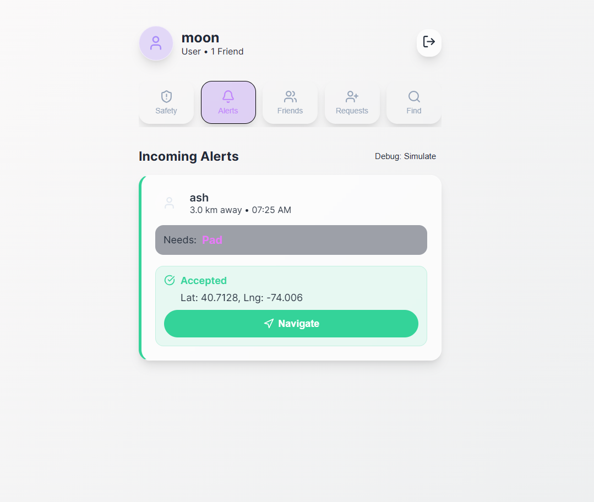
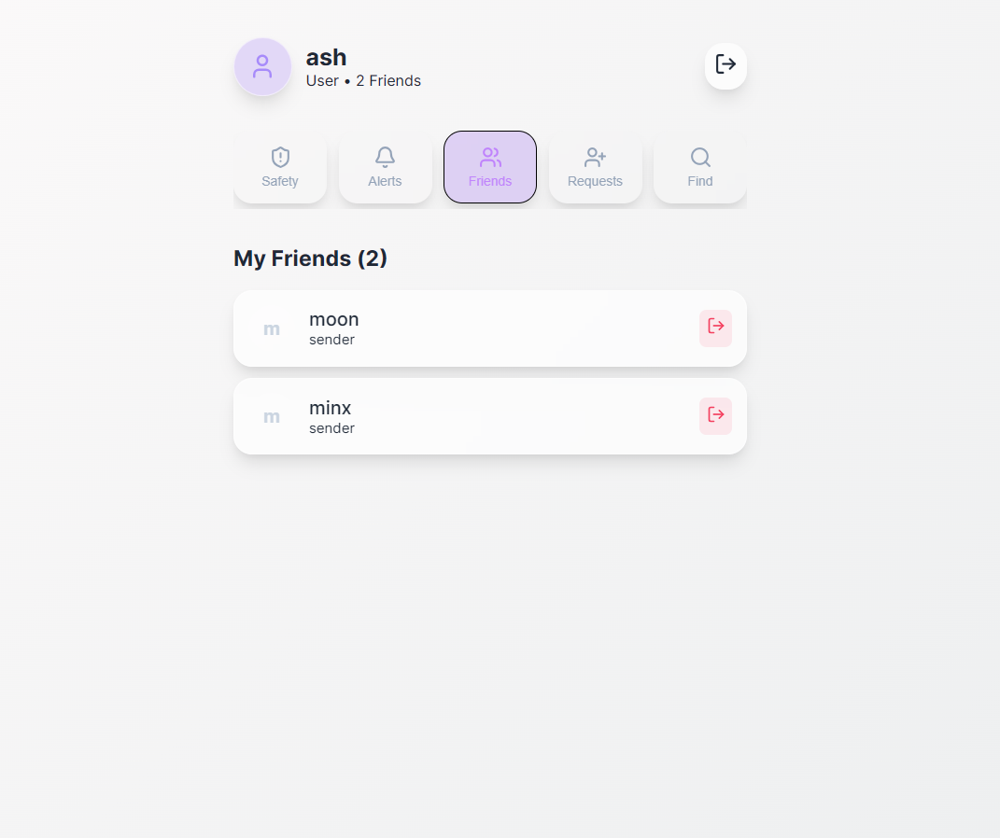

<p align="center">
  
</p>

# Luna- for women, by women

## Basic Details

### Team Name: SuuperGurl

### Team Members
- Member 1: Aswathy M S - Christ College of Engineering, Irinjalakuda
- Member 2: Bhuvana P P - Christ College of Engineering, Irinjalakuda

### Hosted Project Link
http://localhost:5173/

### Project Description
Luna is an exclusive platform built for women, focusing on safety, dignity, and mutual support.
By leveraging location-based alerts, the app enables women to respond to emergency sanitary needs through a trusted community network.

### The Problem statement
Menstrual emergencies are common yet often unsupported situations faced by women. Unexpected periods and lack of sanitary products can cause stress, discomfort, and embarrassment. There is no secure, location-based platform that connects women in need with trusted nearby helpers in real time.

### The Solution
To solve unexpected period emergencies, Luna enables women to send emergency pad requests exclusively to their followers using location-based alerts. This follower-only approach creates a safe, trusted support network where women can receive timely help without compromising privacy.
Luna aims to bridge the gap through a safe, private, and community-driven solution.

---

## Technical Details

### Technologies/Components Used

**For Software:**
- Languages used: Python, HTML, CSS
- Frameworks used: None (Built using core Python and basic web technologies)
- Libraries used: antigravity (Python built-in module)
- Tools used: VS Code, Git, Git Bash, Git Hub

---

## Features

List the key features of your project:
- Feature 1: Emergency Sanitary Alert System
Users can send an emergency alert requesting a sanitary pad, tampon, or menstrual cup. The alert is shared only with the user’s followers within a 3 km radius, ensuring a trusted and localized support network.
- Feature 2: Privacy-First Acceptance Flow
Recipients can choose to accept or ignore the alert. The requester’s name and live location are revealed only after the recipient accepts, maintaining user privacy and safety at all stages.
- Feature 3: Location-Based Matching
The system uses location data to notify only nearby followers, enabling faster response times and minimizing unnecessary exposure.
- Feature 4: Women-Only Safe Space
Luna is exclusively designed for women, creating a secure environment for sharing concerns, asking questions, and seeking support without fear or discomfort.

---

## Implementation

### For Software:

#### Installation
```bash
[Installation commands - e.g., npm install, pip install -r requirements.txt]
```

#### Run
```bash
[Run commands - e.g., npm start, python app.py]
```


---

## Project Documentation

### For Software:

#### Screenshots (Add at least 3)


Login page





*Add caption explaining what this shows*






#### Diagrams

**System Architecture:**


*Explain your system architecture - components, data flow, tech stack interaction*

**Application Workflow:**


*Add caption explaining your workflow*

---


#### Build Photos


*List out all components shown*


*Explain the build steps*


*Explain the final build*

---

## Additional Documentation

### For Web Projects with Backend:

#### API Documentation

**Base URL:** `https://api.yourproject.com`

##### Endpoints

**GET /api/endpoint**
- **Description:** [What it does]
- **Parameters:**
  - `param1` (string): [Description]
  - `param2` (integer): [Description]
- **Response:**
```json
{
  "status": "success",
  "data": {}
}
```

**POST /api/endpoint**
- **Description:** [What it does]
- **Request Body:**
```json
{
  "field1": "value1",
  "field2": "value2"
}
```
- **Response:**
```json
{
  "status": "success",
  "message": "Operation completed"
}
```

[Add more endpoints as needed...]

---

### For Mobile Apps:

#### App Flow Diagram


*Explain the user flow through your application*

#### Installation Guide

**For Android (APK):**
1. Download the APK from [Release Link]
2. Enable "Install from Unknown Sources" in your device settings:
   - Go to Settings > Security
   - Enable "Unknown Sources"
3. Open the downloaded APK file
4. Follow the installation prompts
5. Open the app and enjoy!

**For iOS (IPA) - TestFlight:**
1. Download TestFlight from the App Store
2. Open this TestFlight link: [Your TestFlight Link]
3. Click "Install" or "Accept"
4. Wait for the app to install
5. Open the app from your home screen

**Building from Source:**
```bash
# For Android
flutter build apk
# or
./gradlew assembleDebug

# For iOS
flutter build ios
# or
xcodebuild -workspace App.xcworkspace -scheme App -configuration Debug
```

---

### For Hardware Projects:

#### Bill of Materials (BOM)

| Component | Quantity | Specifications | Price | Link/Source |
|-----------|----------|----------------|-------|-------------|
| Arduino Uno | 1 | ATmega328P, 16MHz | ₹450 | [Link] |
| LED | 5 | Red, 5mm, 20mA | ₹5 each | [Link] |
| Resistor | 5 | 220Ω, 1/4W | ₹1 each | [Link] |
| Breadboard | 1 | 830 points | ₹100 | [Link] |
| Jumper Wires | 20 | Male-to-Male | ₹50 | [Link] |
| [Add more...] | | | | |

**Total Estimated Cost:** ₹[Amount]

#### Assembly Instructions

**Step 1: Prepare Components**
1. Gather all components listed in the BOM
2. Check component specifications
3. Prepare your workspace

*Caption: All components laid out*

**Step 2: Build the Power Supply**
1. Connect the power rails on the breadboard
2. Connect Arduino 5V to breadboard positive rail
3. Connect Arduino GND to breadboard negative rail

*Caption: Power connections completed*

**Step 3: Add Components**
1. Place LEDs on breadboard
2. Connect resistors in series with LEDs
3. Connect LED cathodes to GND
4. Connect LED anodes to Arduino digital pins (2-6)

*Caption: LED circuit assembled*

**Step 4: [Continue for all steps...]**

**Final Assembly:**

*Caption: Completed project ready for testing*

---

### For Scripts/CLI Tools:

#### Command Reference

**Basic Usage:**
```bash
python script.py [options] [arguments]
```

**Available Commands:**
- `command1 [args]` - Description of what command1 does
- `command2 [args]` - Description of what command2 does
- `command3 [args]` - Description of what command3 does

**Options:**
- `-h, --help` - Show help message and exit
- `-v, --verbose` - Enable verbose output
- `-o, --output FILE` - Specify output file path
- `-c, --config FILE` - Specify configuration file
- `--version` - Show version information

**Examples:**

```bash
# Example 1: Basic usage
python script.py input.txt

# Example 2: With verbose output
python script.py -v input.txt

# Example 3: Specify output file
python script.py -o output.txt input.txt

# Example 4: Using configuration
python script.py -c config.json --verbose input.txt
```

#### Demo Output

**Example 1: Basic Processing**

**Input:**
```
This is a sample input file
with multiple lines of text
for demonstration purposes
```

**Command:**
```bash
python script.py sample.txt
```

**Output:**
```
Processing: sample.txt
Lines processed: 3
Characters counted: 86
Status: Success
Output saved to: output.txt
```

**Example 2: Advanced Usage**

**Input:**
```json
{
  "name": "test",
  "value": 123
}
```

**Command:**
```bash
python script.py -v --format json data.json
```

**Output:**
```
[VERBOSE] Loading configuration...
[VERBOSE] Parsing JSON input...
[VERBOSE] Processing data...
{
  "status": "success",
  "processed": true,
  "result": {
    "name": "test",
    "value": 123,
    "timestamp": "2024-02-07T10:30:00"
  }
}
[VERBOSE] Operation completed in 0.23s
```

---

## Project Demo

### Video
[Add your demo video link here - YouTube, Google Drive, etc.]

*Explain what the video demonstrates - key features, user flow, technical highlights*

### Additional Demos
[Add any extra demo materials/links - Live site, APK download, online demo, etc.]

---

## AI Tools Used (Optional - For Transparency Bonus)

If you used AI tools during development, document them here for transparency:

**Tool Used:** [e.g., GitHub Copilot, v0.dev, Cursor, ChatGPT, Claude]

**Purpose:** [What you used it for]
- Example: "Generated boilerplate React components"
- Example: "Debugging assistance for async functions"
- Example: "Code review and optimization suggestions"

**Key Prompts Used:**
- "Create a REST API endpoint for user authentication"
- "Debug this async function that's causing race conditions"
- "Optimize this database query for better performance"

**Percentage of AI-generated code:** [Approximately X%]

**Human Contributions:**
- Architecture design and planning
- Custom business logic implementation
- Integration and testing
- UI/UX design decisions

*Note: Proper documentation of AI usage demonstrates transparency and earns bonus points in evaluation!*

---

Made with ❤️ at TinkerHub
